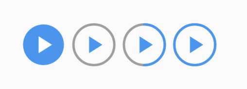

# flutter_progressed_play_button

A simple Flutter widget that presents a "play button" with a progress drawn as
an arc around the icon.

An example built by Flutter Web is available at
[here](https://zonble.github.io/flutter_progressed_play_button/).

The widget has two state. You can decide to draw the progress or not by
specifying the [showProgress] property.

When you wan to show the progress, just set it to the [progress] property. The
values could range from 0.0 to 1.0.

The package is derived from our app "KKBOX Kids".
